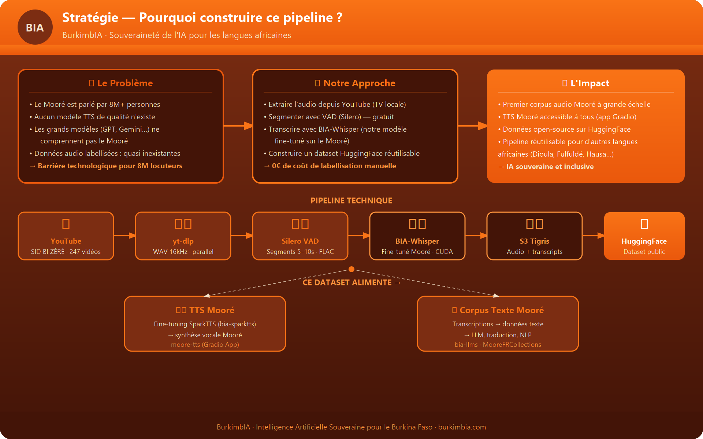
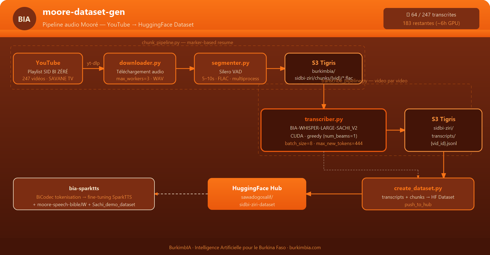

# moore-dataset-gen

Pipeline de génération de dataset audio Mooré à partir de YouTube.





## Vue d'ensemble

Ce projet construit un corpus audio annoté en langue **Mooré** (langue du Burkina Faso) à partir d'émissions YouTube, en 4 étapes :

```
YouTube → Segmentation VAD → Transcription Whisper → HuggingFace Dataset
```

### Projet actif : `sidbi-ziri`
- **Source** : Émission *SID BI ZÉRÉ* — SAVANE TV
- **Playlist** : 247 vidéos
- **Dataset** : `sawadogosalif/sidbi-ziri-dataset`

---

## Structure

```
moore-dataset-gen/
├── chunk_pipeline.py        # Étape 1 & 2 : Download + Segmentation VAD → S3
├── transcribe_pipeline.py   # Étape 3 : Transcription Whisper → S3
├── create_dataset.py        # Étape 4 : S3 → HuggingFace Dataset
│
├── downloader.py            # yt-dlp parallel download
├── segmenter.py             # Silero VAD segmentation (FLAC, 5–10s)
├── transcriber.py           # Whisper batch transcription (CUDA)
├── s3_utils.py              # Tigris S3 helpers
│
├── projects/
│   └── sidbi-ziri/
│       └── config.yaml      # Config du projet
│
├── models/                  # Modèles cachés localement
├── logs/                    # Logs par projet
├── docs/
│   ├── strategy.png         # Pourquoi ce pipeline (vision stratégique)
│   └── architecture.png     # Diagramme technique du pipeline
│
├── pyproject.toml
└── .env                     # Credentials Tigris S3 (non versionné)
```

---

## Configuration S3 (Tigris)

```
Bucket : burkimbia
Endpoint : https://fly.storage.tigris.dev

sidbi-ziri/
├── chunks/{video_id}/*.flac        # Segments audio VAD
└── transcripts/{video_id}.jsonl    # Transcriptions Whisper
```

---

## Lancer le pipeline

### Prérequis

```bash
uv sync  # installe les dépendances (CUDA torch via index pytorch-cu124)
cp path/to/.env .env  # credentials AWS/Tigris
```

### Étape 1 — Download + Segmentation

```bash
uv run --no-sync python chunk_pipeline.py projects/sidbi-ziri/config.yaml
```

### Étape 2 — Transcription (GPU requis)

```bash
uv run --no-sync python transcribe_pipeline.py projects/sidbi-ziri/config.yaml
```

> **Note GPU** : Le pipeline utilise greedy decoding (`num_beams=1`, `max_new_tokens=444`) pour tenir dans 8GB VRAM. Beam search par défaut causait des OOM sur RTX 4060.

### Étape 3 — Push HuggingFace

```bash
uv run --no-sync python create_dataset.py projects/sidbi-ziri/config.yaml
```

---

## Modèle de transcription

| Paramètre | Valeur |
|-----------|--------|
| Modèle | `burkimbia/BIA-WHISPER-LARGE-SACHI_V2` |
| Base | Whisper Large fine-tuné Mooré |
| Language tag | `hausa` (proxy pour Mooré) |
| Decoding | Greedy (`num_beams=1`) |
| batch_size | 8 |
| max_new_tokens | 444 (= 448 - 4 tokens spéciaux) |

---

## Format des transcriptions (JSONL)

```json
{"path": "s3://burkimbia/sidbi-ziri/chunks/VIDEO_ID/seg_001.flac", "duration": 7.4, "text": "...", "language": "hausa"}
```

---

## État actuel

| Étape | Statut |
|-------|--------|
| Download + Segmentation | ✅ 247/247 vidéos |
| Transcription | 🔄 64/247 (183 restantes, ~10h) |
| Dataset HuggingFace | ⏳ En attente |
